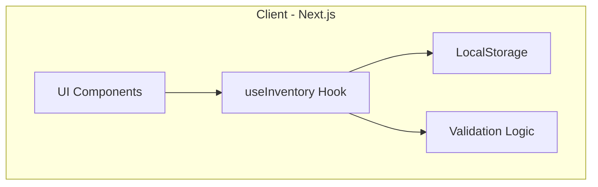
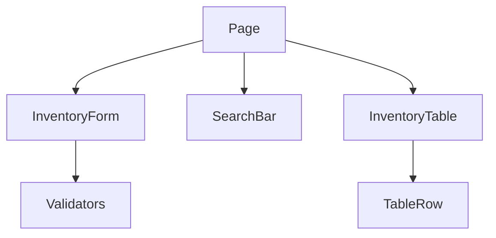

# Inventory Tracker — Documentație Tehnică

## 1. Prezentare Generală

Aplicația **Inventory Tracker** este o aplicație web modernă destinată gestionării unui inventar personal. Utilizatorul poate adăuga, edita și șterge articole din inventar, fiecare articol fiind definit printr-un **nume**, un **număr de serie** și o **valoare numerică estimată**.

Aplicația este dezvoltată predominant pe **client-side**, utilizând **React / Next.js**, respectând cerințele moderne de dezvoltare web: interfață responsive, cod modular, validări, testare unitară și deployment.

---

## 2. Obiective Tehnice

- Implementarea unei aplicații web moderne folosind **Next.js + React + TypeScript**
- Crearea unei interfețe responsive și accesibile cu **Tailwind CSS**
- Organizarea logicii aplicației folosind **custom React Hooks**
- Persistența datelor folosind **LocalStorage**
- Validări clare și mesaje de eroare user-friendly
- Implementarea funcționalităților de sortare, căutare și filtrare
- Exportul datelor în format **CSV**
- Testare unitară folosind **Vitest** și **Testing Library**
- Deployment pe o platformă cloud (**Vercel**)

---

## 3. Funcționalități

- Adăugare articole în inventar (Create)
- Editare articole existente (Update)
- Ștergere articole cu confirmare (Delete)
- Validare input-uri:
  - Nume minim
  - Serial alfanumeric
  - Valoare numerică pozitivă
- Sortare după:
  - Nume
  - Număr de serie
  - Valoare
- Căutare după:
  - Nume
  - Număr de serie
- Filtrare după interval de valori (min–max)
- Persistență după refresh (LocalStorage)
- Exportul inventarului afișat în format **CSV**
- Mesaje diferențiate pentru:
  - lipsa articolelor
  - lipsa rezultatelor după filtrare
- Interfață responsive (mobil & desktop)

---

## 4. Tehnologii Utilizate

### Frontend

- Next.js (React 18)
- TypeScript
- Tailwind CSS

### Testare

- Vitest
- @testing-library/react
- @testing-library/user-event
- jsdom

### Stocare Date

- LocalStorage (JSON)

### Deployment

- Vercel

---

## 5. Metodologie Agile

Dezvoltarea aplicației a urmat o abordare **Agile**, organizată pe sprint-uri incrementale, fiecare sprint având obiective clare și livrabile funcționale.

### Sprint-uri

1. **Sprint 0** – Setup proiect, configurare tooling, structură inițială  
2. **Sprint 1** – CRUD complet + persistență LocalStorage  
3. **Sprint 2** – Sortare, căutare, filtrare, export CSV  
4. **Sprint 3** – UX, responsive design, polish UI  
5. **Sprint 4** – Testare unitară, documentație, deployment  

### Flux de dezvoltare

---

## 6. Arhitectura Aplicației

---

## 7. Arhitectura Componentelor React

---

## 8. Documentație Logică Aplicație (Client-Side)

Aplicația Inventory Tracker nu utilizează un backend sau un API REST clasic, fiind o aplicație dezvoltată predominant pe client-side.

Logica aplicației este organizată modular și include:
- gestionarea stării inventarului
- validarea datelor introduse de utilizator
- persistarea datelor în LocalStorage
- generarea și exportul fișierelor CSV

### Funcții principale

- **addItem** – adaugă un articol nou în inventar
- **updateItem** – modifică un articol existent
- **deleteItem** – șterge un articol din inventar
- **toggleSort** – schimbă criteriul și direcția de sortare
- **itemsToCSV** – generează fișier CSV pe baza inventarului curent

---

## 9. Rute Frontend

Aplicația este o aplicație de tip Single Page Application (SPA), realizată cu Next.js.

### Rută principală

| Rută | Componentă | Descriere |
|----|-----------|-----------|
| / | page.tsx | Pagina principală a aplicației (formular, căutare, tabel inventar) |

Navigarea și actualizarea interfeței se realizează dinamic, fără reîncărcarea paginii, prin mecanismele React.

---

## 10. Concluzii

Inventory Tracker este o aplicație web modernă, dezvoltată conform principiilor actuale de inginerie software. Proiectul demonstrează utilizarea eficientă a React, TypeScript și Tailwind CSS, precum și aplicarea metodologiei Agile prin dezvoltare incrementală.

Aplicația îndeplinește toate cerințele specificate în temă și poate fi extinsă cu funcționalități suplimentare, precum autentificare, import de date sau vizualizări grafice.